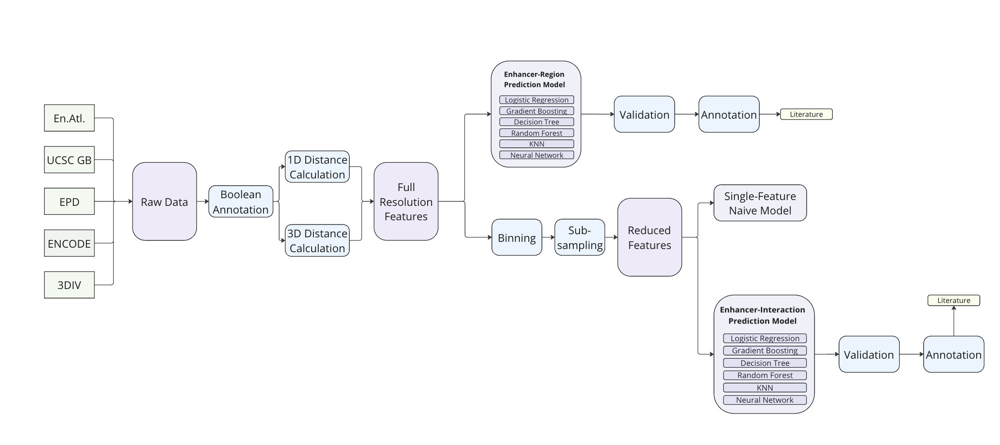

# Enhancer X

Link to the Github Repository: https://github.com/HyunchangOh/EnhancerX

Predicting enhancers is challenging due to several factors: they are located in vast non-coding regions of the genome, lack consistent sequence motifs, and their activity varies across different cell types, developmental stages, and environmental conditions. Additionally, enhancers often exhibit redundancy and can function modularly, further complicating their identification. Accurate prediction of enhancers is crucial because they are involved in many biological processes and diseases. 

Our goal with Enhancer X is to predict enhancers using different genomic annotations. By combining various data sources and using advanced computational methods, Enhancer X aims to improve the accuracy and reliability of enhancer prediction. This, in turn, will enhance our understanding of gene regulation and its implications for health and disease. Specifically, we developed two models: one for predicting enhancers based on interactions and another for predicting enhancers from regions. 

This GitHub repository contains all the code used for creating the region model, including data preprocessing, various model constructions and data visualizations. Since we are dealing with big data, it will not be uploaded to the GitHub repo. The sub-sampled data can be accessed through the following link:  
https://drive.google.com/file/d/1xoGo9fNkEYFD-tSqfSNv6_HMYIbnYulb/view?usp=sharing

Data is structured as one folder for each chromosome, and inside, one .npy file per feature (already binned and sub-sampled). As an example, the file that stores the 3D distances from h3k4me1 methylation sites to promoters, from chromosome 1, is located at:  
/Susampled_Final/chr1/BIN50_h3k4me1_3D_Dist.npy  
See list of features below.


## Workflow
 

## Orgnisation
```
EnhancerX/
|
├── data/*omitted on Github (very big)
|   ├── hg19/ *reference
|   |   └── chr1.fa
|   ├── ...
|   └── enhancer_atlas/
|       └── GM12878.txt
|
├── la_grande_table/*omitted on Github (even bigger)
|   ├── chr1/
|   ├── ... *for all chromosomes
|   └── chrY/
|
├── Subsampled_Final/*omitted on Github (also big), stores binned and subsampled LGT
|   ├── chr1/
|   ├── ... *for all chromosomes except Y
|   └── chrX/
|
├── preprocess/
|   ├── 3DIV/
|   ├── ENCODE/
|   |   ├── CTCF/
|   |   ├── .../ *more directories per feature
|   |   └── h3k36me3/
|   |        ├── annotate.py *reads raw data to create boolean annotation
|   |        ├── calculate_1D_distance.py *calculate 1D distance to nearest feature
|   |        └── calculate_3D_distance.py *calculate 3D distance to nearest feature
|   |
|   ├── .../ *more directories per database
|   ├── SubSampling/ *performs subsampling
|   └── bin/ *performs binning
|
├── processed/ 
|   ├── VISTA/
|   |   └── vista.tsv 
|   ├── enrichment_GC_PER_sequence.tsv
|   └── la_grande_table_gen.py
|
├── interaction_model/
|   └── enhancer.ows *orange workflow file to build and test interaction model
|
├── model/
|   ├── Random Forest/
|   ├── MLP/
|   ├── gradient_boosting/
|   |   ├── metropolis_hastings/ *search based algorithm to optimize hyperparameters
|   |   └── model_... *contains models with different hyperparameters to test
|   ├── .../ *more directories per models
|   └── plots_each/ *storage for plots
|
├── plots/
|   ├── Vingron/ *draws Vingron plots and apply statistical tests
|   ├── Vingron_Combine/ *combines the plots for each feature and beautifies
|   ├── Vingron3D/ *same as the Vingron counterparts, but for 3D distances
|   └── Vingron_Combine_3D/
|
├── .gitignore
└── README.md
```

### preprocess

#### Databases
List of Database-subdirectories:
Basic structure: preprocess - database - accessions
* 3DIV (only at root)
* ENCODE
* enhancer_atlas (only at root)
* EPD (only at root)
* VISTA (only at root)

Each accession subdirectory contains codes for:
* boolean annotation of each feature
* 1D distance calculation
* 3D distance calculation

Note that 3D distance calculation was done with respect to 3DIV database.

#### Further Preprocessing
* bin
bin contains for binnning, which is combining the features of 'n=50' subsequent base pairs to reduce the data size.

* Subsampling
As there are much more non-enhancers than enhancers, subsampling has been performed to tackle this imbalance (subsampling ratio 1:1)

### plots
Vingron plots are distribution plots of enhancer-feature / promoter-feature distances which were used to justify the use of our feature engineering involving 1D and 3D distances.

Also contains 'FeatureAnalysis.py' which calculates the most contributing features and plot them for tree-like learning algorithms.

For further information for the plots, refer to the README in this directory.

### model
For more details on the model directory and finally selected models, refer to the README in the model directory.

#### Learning Methods
* Logistic Regression (logistic_regression)
* Random Forest (Random Forest)
* Gradient Boosting (gradient_boosting)
* Multilayer Perceptron (MLP, HANNs)
* Single Feature Naive (single_feature)

Note that the directory also contains many different versions of each learning methods, often implemented using different libraries. Each subdirectory contains multiple python scripts for different models, mostly built to test different hyperparameters.

#### Metropolis Hastings
The subdirectories 'Random Forest' and 'gradient_boosting' contains an additional subdirectory called 'metropolis_hastings.' As they were the most well-performing models in the exploratory models, metropolis hastings algorithm was applied to further fine-tune the hyperparameters. This directory also contains code to plot the progress of the algorithm.

#### overall_analysis
This subdirectory contains code to apply each learning method to 'interchromosome analysis', where the model is trained for one chromosome and tested for all other chromosomes for robustness.

Also, the (sub)finally selected models are applied to the entire data to yield the final evaluation metrics at the root directory of this subdirectory.

### interaction_model

#### How to Install Orange
Orange is a GUI-based data mining software that offers scikit-learn based learning algorithms. As the interaction database was small enough to be run locally, Orange was used predominantly to train and test the interaction models. 

We have tested Orange distributions for Windows10 and macOS, and the results were built by Orange3-3.37.0 on Windows10 22H2.

https://orangedatamining.com/download/

#### How to Use the Workflow
The orange workflow that we used is stored at the directory "interaction_model." 
After Orange has been installed, open the .ows file with Orange and download '3div.tsv' from the drive and feed it into the 'Data' widget.


## Features  

Tip: file_name = "BIN50_" + feature_name + ".npy"  

### Predictor variable  

  enhancer_atlas


### List of features  

  cod  
  cod_1D_Dist  

  promoter_any  
  promoter_1D_Dist_any  
  promoter_3D_Dist_any  
  promoter_forward  
  promoter_1D_Dist_forward  
  promoter_reverse  
  promoter_1D_Dist_reverse  

  h3k4me1  
  Bh3k4me1_1D_Dist  
  Bh3k4me1_3D_Dist  

  h3k4me2  
  Bh3k4me2_1D_Dist  
  h3k4me2_3D_Dist  

  h3k9me3  
  h3k9me3_1D_Dist  
  h3k9me3_3D_Dist  

  h3k27ac  
  h3k27ac_1D_Dist  
  h3k27ac_3D_Dist  

  h3k27me3  
  h3k27me3_1D_Dist  
  h3k27me3_3D_Dist  

  h3k36me3  
  h3k36me3_1D_Dist  
  h3k36me3_3D_Dist  

  CTCF  
  CTCF_1D_Dist  
  CTCF_3D_Dist  
    
  DHS  
  DHS_1D_Dist  
  DHS_3D_Dist  

  EP300Conservative  
  EP300Conservative_1D_Dist  
  EP300Conservative_3D_Dist  

  Interaction_1D_Dist  
